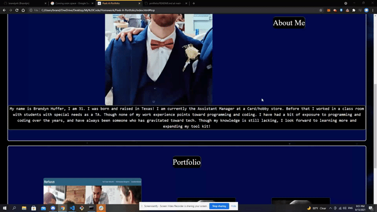

# Peek-A-Portfolio

Brandyn's Portfolio

## Description

This is a portfolio I created using various HTML and CSS techniques

## Installation 

Click on [Deployed Website](https://brandynh.github.io/Peek-A-Portfolio/) link

## Screenshot

## Credits 
    
By : Brandyn Huffer

### References

* [W3Schools](https://www.w3schools.com/)
* [BootCamp Markup Guide](https://coding-boot-camp.github.io/full-stack/github/professional-readme-guide)
* [Mozilla MDN](https://developer.mozilla.org/en-US/docs/Learn/CSS)

